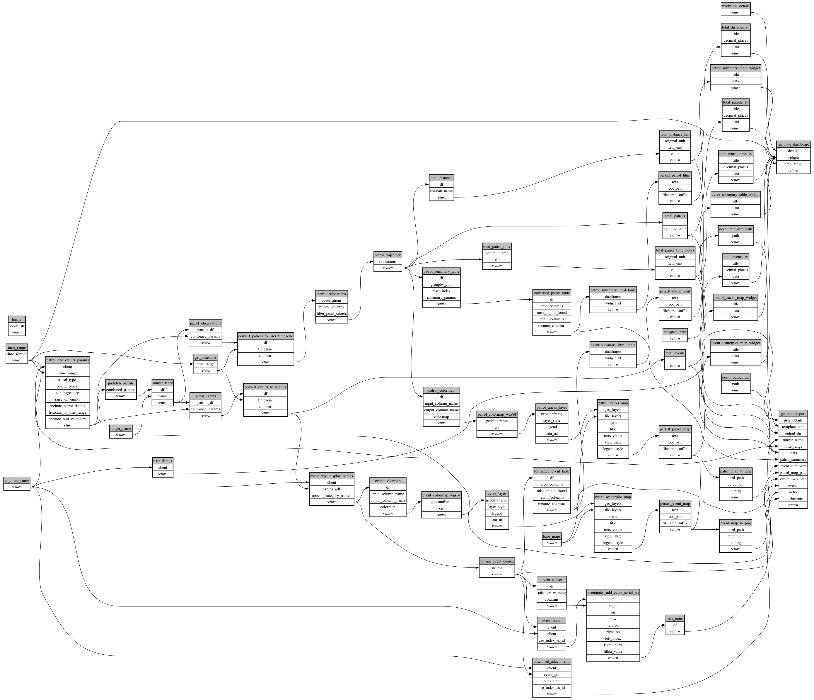

```
# AUTOGENERATED BY ECOSCOPE-WORKFLOWS; see fingerprint in README.md for details

```

```yaml
# fingerprint:
artifacts_sha256_basic: 3ea1bfcad89b26c0113b4506338e67805d086c62b8e19338dbf5501c484b2a79
artifacts_sha256_strict: 1de4ac43ce667191dd57c397c27c7aaf60794c652a4c2505a939ea4af3df83d0
installed_requirements:
- channel: https://repo.prefix.dev/ecoscope-workflows/
  name: ecoscope-workflows-core
  version: {version: ==0.22.18}
- channel: https://repo.prefix.dev/ecoscope-workflows/
  name: ecoscope-workflows-ext-ecoscope
  version: {version: ==0.22.18}
- channel: https://repo.prefix.dev/ecoscope-workflows-custom/
  name: ecoscope-workflows-ext-custom
  version: {version: ==0.0.57}
- channel: conda-forge
  name: pydeck
  version: {version: ==0.9.2}
- channel: https://repo.prefix.dev/ecoscope-workflows-custom/
  name: ecoscope-workflows-ext-icf
  version: {version: ==0.0.11}
params_sha256: 46ce9eea2b44e58495c5ecf79f9ac14229f30c4d8fbafb0d544c979343441d05
spec_sha256: fba7c82904b59386c89872a7be2343f3fd551ae11436fc6121c4c2feb89edd37

```

# ecoscope-workflows-ranger-report-workflow


